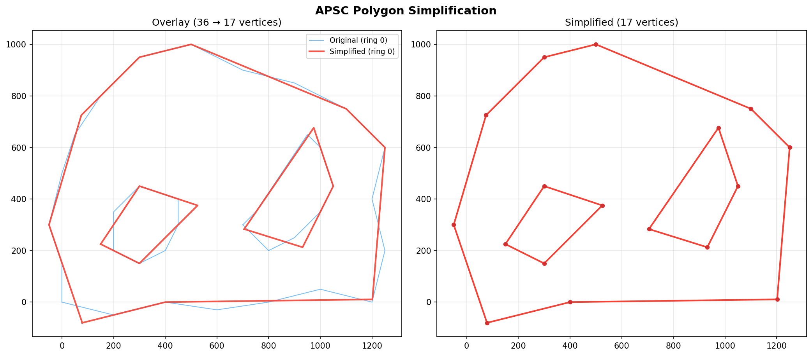

# Area- and Topology-Preserving Polygon Simplification

APSC (Area-Preserving Segment Collapse) algorithm based on the paper by Kronenfeld et al. (2020) for CSD2183 Data Structures Assignment 2.

The goal is to reduce the number of vertices in a polygon while keeping the total area exactly the same and making sure no edges cross or overlap. It handles polygons with holes too.

## How to Build

You just need a C++17 compiler (g++). No external libraries needed.

```bash
make
```

This gives you a `simplify` executable in the project root.

## How to Run

```bash
./simplify <input_file.csv> <target_vertices>
```

- `input_file.csv` - a CSV file with columns `ring_id,vertex_id,x,y`
- `target_vertices` - how many vertices you want in the simplified result

The output goes to stdout: a CSV of the simplified polygon, followed by three lines showing the original area, simplified area and the areal displacement between them. Timing and memory stats are printed to stderr.

## Benchmarking

```bash
bash benchmark.sh [test_cases_dir]
```

The benchmark script runs `simplify` on every CSV in the given directory (defaults to `test_cases/`) and produces two kinds of output:

- **`benchmark_outputs/*.txt`** — the full stdout of each run (simplified polygon CSV + area stats)
- **`benchmark_results.csv`** — a summary CSV with columns: `file, vertices, parse_ms, setup_ms, simplify_ms, total_ms, memory_kb`

## How It Works

The basic idea is to repeatedly collapse pairs of adjacent vertices into a single Steiner point, always picking the collapse that causes the least distortion.

- **Circular doubly-linked lists** store each polygon ring, so inserting and removing vertices during collapses is O(1).
- **A min-heap (priority queue)** keeps track of all possible collapses sorted by how much area they'd displace. Stale entries are handled with version counters on each vertex rather than deleting from the heap.
- **Steiner point placement** when collapsing vertices B and C (with neighbors A and D), the replacement point E is placed along a constraint line that preserves the area exactly. The algorithm picks the best placement following the rules from the Kronenfeld paper.
- **Grid-based spatial index** speeds up intersection checks so the program can handle large inputs (100K+ vertices) without grinding to a halt.
- **Topology checks** run before every collapse to make sure no new edges would cross existing ones, and no vertex ends up sitting on an edge.

## Test Results

All test cases pass with area preserved exactly (within floating-point tolerance) and no topology violations. The `test_cases/` folder contains the instructor-provided inputs and expected outputs.

### Correctness Verification (Instructor Test Cases)

| Test Case | Input Vertices | Target | Output Vertices | Input Area | Output Area | Area Preserved | Areal Displacement |
|---|---|---|---|---|---|---|---|
| rectangle_with_two_holes | 12 | 7 | 11 | 3.210000e+02 | 3.210000e+02 | Yes | 1.600000e+00 |
| cushion_with_hexagonal_hole | 22 | 13 | 13 | 9.450000e+03 | 9.450000e+03 | Yes | 3.840642e+02 |
| blob_with_two_holes | 36 | 17 | 17 | 9.210000e+05 | 9.210000e+05 | Yes | 7.352546e+04 |
| wavy_with_three_holes | 43 | 21 | 21 | 9.845000e+05 | 9.845000e+05 | Yes | 1.110715e+05 |
| lake_with_two_islands | 81 | 17 | 17 | 2.840000e+05 | 2.840000e+05 | Yes | 1.483617e+05 |
| original_01 | 1,860 | 99 | 99 | 1.305116e+09 | 1.305116e+09 | Yes | 1.455825e+07 |
| original_02 | 8,605 | 99 | 99 | 9.432032e+08 | 9.432032e+08 | Yes | 1.608405e+07 |
| original_03 | 74,559 | 99 | 99 | 5.540650e+08 | 5.540650e+08 | Yes | 2.832084e+08 |
| original_04 | 6,733 | 99 | 99 | 3.115586e+07 | 3.115586e+07 | Yes | 1.658035e+07 |
| original_05 | 6,230 | 99 | 99 | 4.982084e+08 | 4.982084e+08 | Yes | 8.800084e+06 |
| original_06 | 14,122 | 99 | 99 | 3.406772e+09 | 3.406772e+09 | Yes | 1.704953e+08 |
| original_07 | 10,596 | 99 | 99 | 2.062881e+08 | 2.062881e+08 | Yes | 4.224921e+07 |
| original_08 | 6,850 | 99 | 99 | 1.277306e+08 | 1.277306e+08 | Yes | 1.045290e+07 |
| original_09 | 409,998 | 99 | 99 | 6.321472e+10 | 6.321472e+10 | Yes | 3.362863e+09 |
| original_10 | 9,899 | 99 | 99 | 5.066884e+08 | 5.066884e+08 | Yes | 2.841795e+07 |

All 15 test cases preserve area exactly (input area = output area) and produce no self-intersections or ring crossings. Where the output vertex count exceeds the target (e.g., rectangle_with_two_holes), this is because each ring requires a minimum of 3 vertices to remain a valid polygon.

### Performance Benchmarks (Instructor Test Cases)

| Test Case | Vertices | Simplify Time (ms) | Total Time (ms) | Memory (kB) |
|---|---|---|---|---|
| rectangle_with_two_holes | 12 | 0.011 | 1.671 | 6,088 |
| cushion_with_hexagonal_hole | 22 | 0.032 | 1.709 | 6,088 |
| blob_with_two_holes | 36 | 0.069 | 1.901 | 6,088 |
| wavy_with_three_holes | 43 | 0.121 | 1.698 | 6,088 |
| lake_with_two_islands | 81 | 0.253 | 1.870 | 6,088 |
| original_01 | 1,860 | 5.067 | 9.373 | 6,696 |
| original_02 | 8,605 | 30.226 | 43.906 | 8,768 |
| original_03 | 74,559 | 258.245 | 364.968 | 28,116 |
| original_04 | 6,733 | 19.088 | 30.082 | 8,072 |
| original_05 | 6,230 | 17.392 | 27.466 | 7,960 |
| original_06 | 14,122 | 45.587 | 66.515 | 10,248 |
| original_07 | 10,596 | 27.362 | 43.218 | 9,560 |
| original_08 | 6,850 | 17.671 | 28.621 | 8,084 |
| original_09 | 409,998 | 3,910.113 | 4,529.177 | 118,452 |
| original_10 | 9,899 | 28.047 | 46.571 | 9,444 |

### Large-Scale Tests (Generated Datasets)

To further validate scalability, we tested on generated polygon datasets with up to 400,000 vertices:

| Vertices | Holes | Simplify Time (ms) | Total Time (ms) | Memory (kB) |
|---|---|---|---|---|
| 100 | 5 | 0.005 | 1.782 | 6,088 |
| 10,026 | 3 | 26.525 | 42.365 | 8,924 |
| 49,255 | 0 | 149.885 | 216.330 | 19,716 |
| 104,691 | 1 | 401.052 | 539.892 | 34,160 |
| 204,637 | 6 | 1,033.908 | 1,299.565 | 56,980 |
| 263,110 | 5 | 3,933.594 | 4,266.851 | 83,224 |
| 338,292 | 4 | 2,378.947 | 2,825.283 | 92,700 |
| 400,000 | 3 | 10,461.975 | 11,014.428 | 146,100 |

All generated dataset tests also preserve area exactly with no topology violations.

### Visualization

A Python script (`visualize.py`) is included to plot the original and simplified polygons side by side using matplotlib.

```bash
python3 visualize.py <input.csv> <output.txt> [save_path.png]
```

Example using the blob with two holes test case (36 → 17 vertices):


